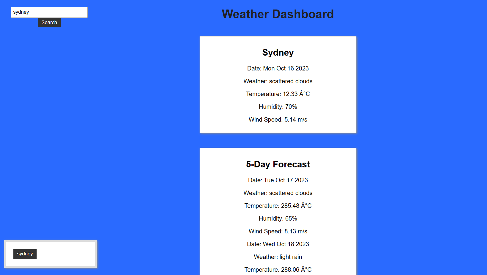

# Weather Forecast App
This is a simple web application that allows users to search for current weather information and a 5-day weather forecast for a specific city. The app fetches weather data from the OpenWeatherMap API using the provided API key and displays it on the webpage. Users can also view their search history and click on previous searches to retrieve weather data for those cities.

## Usage
Enter the name of the city you want to check the weather for in the input field.

Click the "Search" button or press Enter.

The current weather and 5-day forecast for the specified city will be displayed on the page.

The city name will also be added to the search history section below the form.

You can click on a city in the search history to retrieve weather information for that city again.

## Features
Display current weather information, including date, weather condition, temperature in Celsius, humidity, and wind speed.
Display a 5-day weather forecast with details for every 24-hour interval.
Store a search history of cities for easy access.

## Built With
HTML, CSS, and JavaScript
OpenWeatherMap API for weather data

## Website :

To access the password generator:

